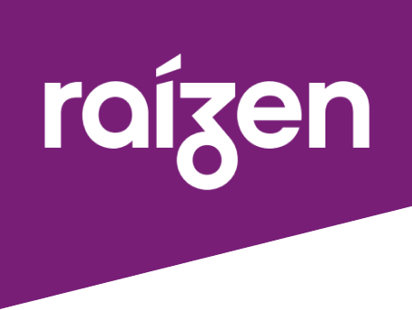
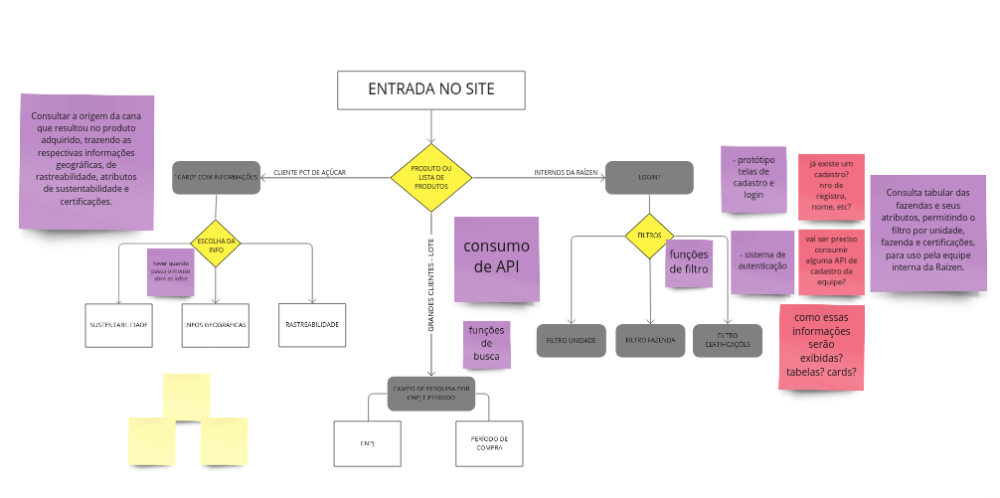
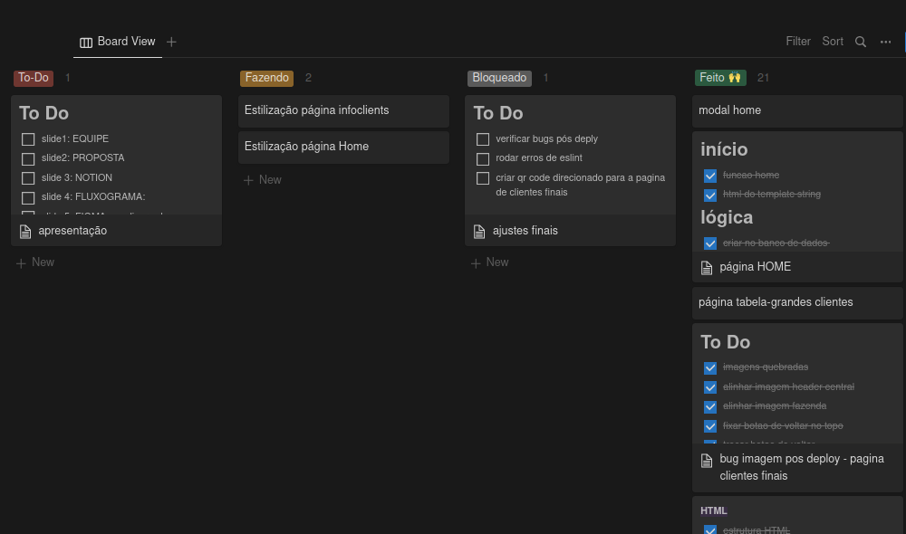
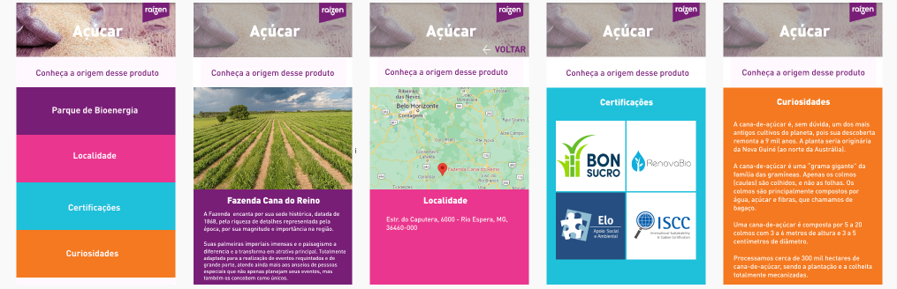
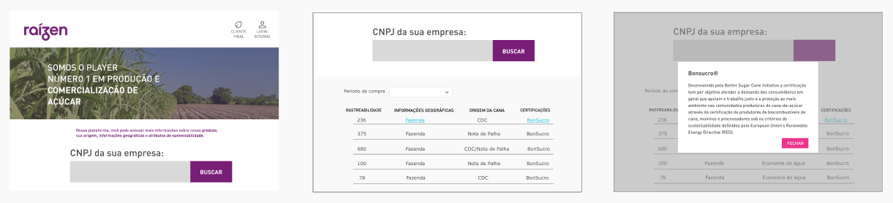
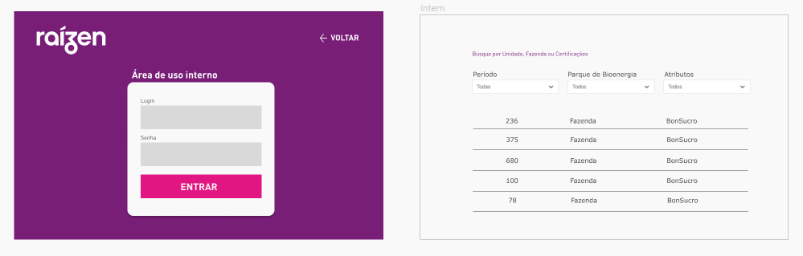

    
  
  # Talent Fest: Raízen
  
   

  
  
  
  
  
   
   
  

   
  
  **Status do Projeto:** _Concluído_ 

  [Confira aqui o resultado do projeto](https://amanda-holanda.github.io/raizen-tf/)

## Índice

* [1. Resumo do projeto](#1-resumo-do-projeto)
* [2. Fluxograma](#2-fluxograma)
* [3. Planejamento](#3-planejamento)  
* [4. Protótipos](#4-protótipos)
* [5. Tecnologias Utilizadas](#5-tecnologias-utilizadas)
* [6. Sobre as desenvolvedoras](#6-sobre-as-desenvolvedoras)

***

## 1. Resumo do projeto

O projeto foi desenvolvido durante o hackaton *Talent Fest* da [Laboratoria](https://github.com/Laboratoria).
A empresa Raízen nos desafiou a desenvolver uma solução de interface web voltada para três tipos de usuários diferentes:
  #### 1. Cliente final: 
  Este deveria visualizar informações sobre a origem do produto que ele consume (açúcar) de forma simples. Solução: através de um QR Code colocado na embalagem do produto, o cliente tem acesso a página com as informações. Para visualizá-la no seu dispositivo móvel, é só acessar abaixo:

  
  
  #### 2. Clientes grandes: 
  Estes deveriam visualizar informações dos seus produtos através do seu CNPJ e do período da compra. Para visualizar melhor os dados, na página principal preencha os campos da seguinte forma:
  * **CNPJ:** 75796555587851
  * **Período:** 01/12/22 - 31/12/2022
  
  #### 3. Funcionários da empresa: 
  Estes deveriam visualizar informações detalhadas sobre as fazendas de cana de açúcar. Para ter acesso ao login, insira os seguintes dados:
  * **email:** maria@raizen.com.br
  * **senha:** raizen1234
   
## 2. Fluxograma

Ao receber o desafio proposto, iniciamos elaborando um fluxograma do projeto e das telas da aplicação, com o objetivo de ter maior clareza durante o seu desenvolvimento. Para isso, utilizamos a ferramenta **Miro**.

  
## 3. Planejamento

O planejamento foi realizado utilizando a ferramenta **Notion** e as **Metologias Ágeis**. Todas as tarefas foram organizadas em "babies steps" e dividas pelo grupo de desenvolvimento por ordem de prioridade.

## 4. Protótipos

Os protótipos foram desenvolvidos pensando no guia de marca da empresa e na melhor experiência do usuário. Para o seu desenvolvimento, utilizou-se a ferramenta **Figma**.

### Página do cliente final:

### Página dos grandes clientes:

### Páginas dos funcionários internos:

## 5. Tecnologias Utilizadas

  -  `HTML`

  -  `CSS`

  -  `Javascript`

  -  `NodeJs`

  -  `Github`

  - `Figma`
  
  - `Firebase`
  
## 6. Sobre as desenvolvedoras

Projeto desenvolvido em equipe por: 
* Amanda Holanda: [Linkedin](https://www.linkedin.com/in/amandaholanda/) | [GitHub](https://github.com/amanda-holanda)
* Isabella Brambilla [Linkedin](https://www.linkedin.com/in/isabella-brambilla/) | [GitHub](https://github.com/bellabrambilla)
* Débora Martins [Linkedin](https://www.linkedin.com/in/d%C3%A9bora-martins-santos/) | [GitHub](https://github.com/deboramds)
* Juliana Reis [Linkedin](https://www.linkedin.com/in/juliana-dos-reis-fernandes/) | [GitHub](https://github.com/Juhreisf)
* Monnalisa Fidelis [Linkedin](https://www.linkedin.com/in/monnalisa-fidelis/) | [GitHub](https://github.com/MonnalisaFidelis)
